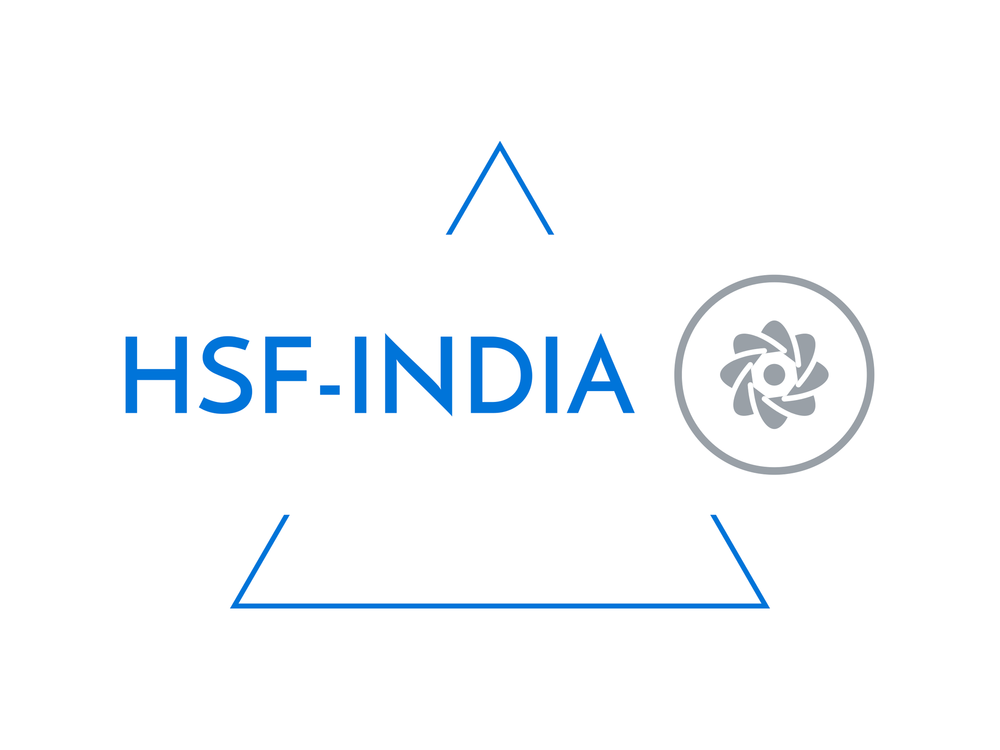

# HSF-India Project: H → WW NanoAOD Analysis

[](https://h-to-ww-nanoaod-analysis.readthedocs.io/en/latest/?badge=latest)
[](LICENSE)


The full documentation for this analysis is available at:
https://h-to-ww-nanoaod-analysis.readthedocs.io/en/latest/

This repository is part of the **[HSF-India project](https://research-software-collaborations.org/)**, focusing on the analysis of Higgs boson decays to **W boson pairs (H → WW → 2ℓ2ν)** using CMS Open Data in the NanoAOD format. The analysis targets the **gluon-gluon fusion (ggH)** production mode with **2016 Ultra-Legacy Monte Carlo** samples at **√s = 13 TeV**.

---

## Physics Overview

The **Higgs boson**, discovered in 2012 at the LHC, acquires mass for elementary particles through the mechanism of **electroweak symmetry breaking**. One of its dominant production modes at the LHC is **gluon-gluon fusion (ggH)**, where two gluons interact via a heavy-quark loop (predominantly the top quark) to produce a Higgs boson.

This analysis focuses on the decay channel:

**$H \to WW \to e\mu + \nu_e\nu_\mu$** (opposite-flavour dilepton final state)

which offers a clean leptonic signature and a sizeable branching fraction, making it a key channel for Higgs measurements.

---

## Repository Structure

```
H-to-WW-NanoAOD-analysis/
│
├── .cache/
├── .gitignore
├── .readthedocs.yml
├── Auxillary_files/
├── CITATION.cff
├── Datasets/
├── LICENSE
├── Outputs/
├── README.md
├── Run_analysis/
├── assets/
├── docs/
├── environment.yml
├── mkdocs.yml
├── notebooks/
│   ├── Combine/
│   ├── Eff_txt_file_cleaning.ipynb
│   ├── HWW_analysis.ipynb          #You might want to start from here.
│   ├── Muon_EFF.ipynb
│   ├── Outputs/
│   │   ├── Cutflow_Raw.csv
│   │   ├── Cutflow_scaled.csv
│   │   ├── HWW_analysis_output.root
│   │   ├── combine_logger.out
│   │   └── Plots/
│   ├── Trigger_efficiency.ipynb
│   ├── prepare_combine.py
│   └── sum_genW.ipynb
├── overrides/
└── requirements.txt
```

---

## Getting Started

## 1. Clone the Repository

```bash title="Terminal"
git clone https://github.com/anrghv/H-to-WW-NanoAOD-analysis.git
cd H-to-WW-NanoAOD-analysis
```

---

## 2. Set Up the Python Environment

The repository includes a complete `environment.yml` specifying all required packages with minimum version constraints:

```bash title="Create and activate the environment"
conda env create -f environment.yml
conda activate HEP_analysis
```

This creates a Conda environment named `HEP_analysis` with:

- All Scikit-HEP packages (`uproot`, `awkward`, `vector`, `hist`)
- Dask for distributed computing
- JupyterLab for interactive notebooks
- `fsspec-xrootd` for XRootD file access

```bash title="Create and activate the virtual environment"
python3 -m venv .venv
source .venv/bin/activate   # Linux / macOS
# .venv\Scripts\activate    # Windows
pip install -r requirements.txt
```

## 3. Verify the Installation

```python title="Verify all packages"
import uproot, awkward as ak, vector, hist, dask
print("All packages loaded successfully.")
print(f"  uproot  : {uproot.__version__}")
print(f"  awkward : {ak.__version__}")
print(f"  dask    : {dask.__version__}")
```

```python title="Test CERN EOS access"
import uproot
with uproot.open(
    "root://eospublic.cern.ch//eos/opendata/cms/mc/"
    "RunIISummer20UL16NanoAODv9/GluGluHToWWTo2L2N_M-125"
    "_TuneCP5_minloHJJ_13TeV-powheg-jhugen727-pythia8/"
    "NANOAODSIM/106X_mcRun2_asymptotic_v17-v2/30000/"
    "00B3B6E3-3D68-C048-A8C4-04EB699CCE5D.root"
    ) as f:
    print(f.keys())
```

---

## 4. Run the Analysis

```bash title="Launch the notebook"
cd notebooks/
jupyter lab HWW_analysis.ipynb
```

## Datasets

All Monte Carlo samples correspond to the **CMS 2016 Ultra-Legacy (Summer20UL16) campaign** and are sourced from CERN Open Data. A full listing of samples, cross sections, and links is available in [`Datasets/README_MC_Samples_2016UL.md`](Datasets/README_MC_Samples_2016UL.md).

| Category        | Example Processes                                       |
| --------------- | ------------------------------------------------------- |
| **Signal**      | $ggH \to WW \to 2\ell2\nu $                             |
| **Backgrounds** | Drell-Yan, $t\bar{t}$, $WW$, Dibsosn, $V\gamma$, W+jets |

---

## References

This analysis is based in part on the methodology described in the following CMS publication.
The ggH production mode selection strategy and signal region definition follow the approach
outlined therein, adapted for CMS Open Data using the Scikit-HEP ecosystem.

- A. Tumasyan et al. (CMS Collaboration), "Measurements of the Higgs boson production cross
  section and couplings in the W boson pair decay channel in proton-proton collisions at √s = 13 TeV,"
  _Eur. Phys. J. C_ **83**, 667 (2023).
  [https://doi.org/10.1140/epjc/s10052-023-11632-6](https://doi.org/10.1140/epjc/s10052-023-11632-6)

## Acknowledgements

This analysis is developed as part of the **HSF-India project**, an initiative to foster research software collaborations between India and the international High Energy Physics community.

<p align="center">
  
</p>
