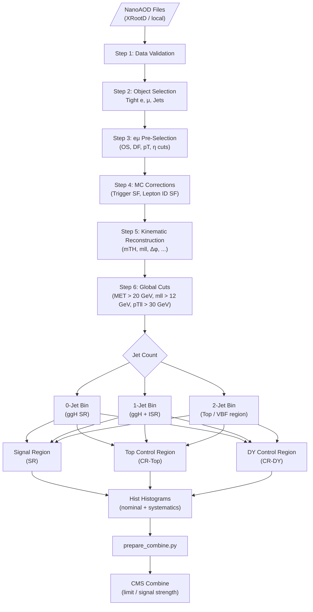

# Process Flowchart

The analysis follows a strict **Cut-and-Count** methodology. Each data chunk (from simulation or observed data) is passed through the following stages in sequence, implemented in `Run_analysis/Run_analysis.ipynb` and `hww_tools/`.

---

## Analysis Flow

### Stage-by-Stage Description

## **NOTE TO SELF: NEED TO FIX THIS**
## Selection Cut Summary

| Stage | Cut | Purpose |
| :--- | :--- | :--- |
| **JSON masking** | CMS Golden JSON (data only) | Remove bad luminosity blocks |
| **MC weight** | $$w = \text{genWeight} \times \frac{\sigma \cdot L}{\sum w_{\text{gen}}}$$ | Normalize simulation to data luminosity |
| **Electron selection** | MVA WP90 ID, $p_T$ > 13 GeV, $\|\eta\|$ < 2.5 | Prompt electrons |
| **Muon selection** | Tight ID, PF isolation < 0.15, $p_T$ > 13 GeV, $\|\eta\|$ < 2.4 | Prompt muons |
| **eμ pre-selection** | Exactly 1e + 1μ, opposite charge | Target final state |
| **Leading lepton** | $p_T$ > 25 GeV | Online trigger threshold |
| **Sub-leading lepton**| $p_T$ > 13 GeV | Offline trigger matching |
| **Trigger SF** | $\eta$–$p_T$ binned lookup | Correct MC trigger efficiency |
| **Lepton ID SF** | $\eta$–$p_T$ binned lookup | Correct MC ID efficiency |
| **Global cut: MET** | $E_T^{\text{miss}}$ > 20 GeV | Reject Drell-Yan and QCD |
| **Global cut: $m_{\ell\ell}$** | $m_{\ell\ell}$ > 12 GeV | Reject low-mass resonances |
| **Global cut: $p_{T\ell\ell}$**| $p_{T\ell\ell}$ > 30 GeV | Reject soft backgrounds |
| **Jet cleaning** | $\Delta R$ > 0.4 to signal leptons | Remove lepton footprints |
| **Jet selection** | $p_T$ > 30 GeV, $\|\eta\|$ < 4.7, Tight ID + PU ID | Define jet collection |

---

## Signal and Control Region Definitions

### Signal Region (SR)
Applied within each jet bin on top of global cuts:

* **b-jet veto:** no b-tagged jets with $p_T$ > 20 GeV → removes $t\bar{t}$
* $m_{TH}$ > 60 GeV → removes $Z \to \tau\tau$
* $m_T(\ell_2, E_T^{\text{miss}})$ > 30 GeV → removes W+jets
* **(2-jet bin only):** $m_{jj}$ outside 65–105 GeV → removes hadronic W/Z

### Top Control Region (CR-Top)
Inverts the b-jet veto to enrich $t\bar{t}$:

* **0-jet bin:** look for soft b-jets (20 < $p_T$ < 30 GeV)
* **1/2-jet bins:** require at least one standard b-jet ($p_T$ > 30 GeV)
* **Additional cut:** $m_{\ell\ell}$ > 50 GeV

### DY Control Region (CR-DY)
Inverts the $m_{TH}$ cut to enrich $Z \to \tau\tau$:

* $m_{TH}$ < 60 GeV
* **b-jet veto** (to stay orthogonal to CR-Top)
* **Z-peak window:** 40 < $m_{\ell\ell}$ < 80 GeV

> **Info: Implementation**
> Region masks are implemented in `hww_tools/cuts.py`. The cutflow is tracked at each stage via `hww_tools/cutflow_utils.py` and printed as a formatted table at the end of the analysis notebook.